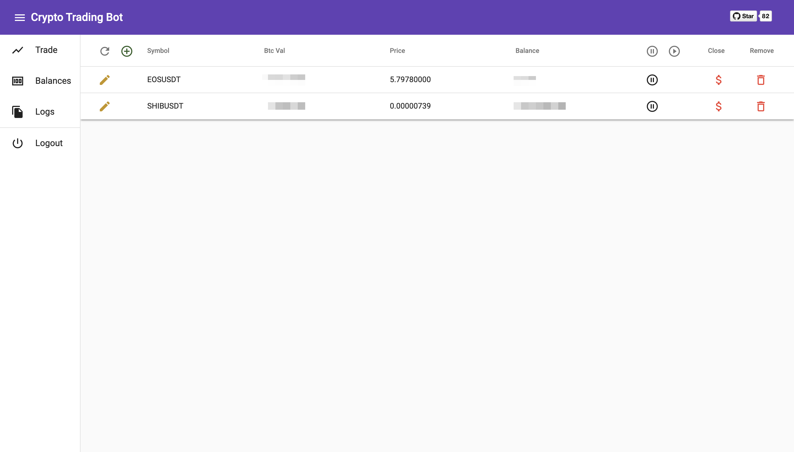

# Cryptobot Setup Instructions
 
## Prerequisite
- Install Docker. For the sake of simplicity, the bot is wrapped into Docker container.
- Create Binance API Key. Make sure it is trading only and restricted to withdrawals. 

## Setting up API
After you get API Key and Secret from Binance there are 2 options how to proceed:
1. Create config file 'api.json' with the following contents:
```json
{
  "exchanges":[
      {
        "name": "binance",
        "key": "YOUR_API_KEY",
        "secret": "YOUR_API_SECRET"
      }
    ]
}
```
2. Pass Key and Secret as parameters to the Docker `-e "KEY=BINANCE_API_KEY"` 
and `-e "SECRET=BINANCE_API_SECRET"`

## Running bot on Mac / Linux
1. Pull the image `docker pull tranhoangson/crypto-bot:stable`.
2. Create the folder for active and completed trades:
    - `mkdir Active` - where you will put all new trades
    - `mkdir Completed` - where bot will put completed trades
3. If you store your API keys in `api.json` file then you need to create another 
folder `mkdir Config` and copy `api.json` there.
4. Run the Bot. You will also need to specify timezone in the `TZ` parameter.
The whole list of timezones is available [here](https://en.wikipedia.org/wiki/List_of_tz_database_time_zones). 
If you don't use `api.json`, just remove this line `-v $(pwd)/Config:/usr/src/configs:ro \ `
```shell
docker run -d --rm --name cryptobot \
-e "TZ=America/New_York" \
-e "KEY=BINANCE_API_KEY" \
-e "SECRET=BINANCE_API_SECRET" \
-v $(pwd)/Active:/usr/src/trades \
-v $(pwd)/Completed:/usr/src/complete_trades \
-v $(pwd)/Config:/usr/src/configs:ro \
tranhoangson/crypto-bot:stable
```

Once the bot is started, you can place your trade files into the `Active` directory, so they picked up by the bot.
If by the start time `Active` directory has trade files they will be picked up as well.

To stop the bot run `docker stop cryptobot`

Running Bot with UI enabled:
```shell
docker run -d --rm -p 3000:3000 --name cryptobot \
-e "TZ=America/New_York" \
-e "KEY=BINANCE_API_KEY" \
-e "SECRET=BINANCE_API_SECRET" \
-e "API_USER=ANY_USER_NAME" \
-e "API_PASS=ANY_PASSWORD" \
-v $(pwd)/Active:/usr/src/trades \
-v $(pwd)/Completed:/usr/src/complete_trades \
-v $(pwd)/Config:/usr/src/configs:ro \
tranhoangson/crypto-bot:stable
```

You need to specify `API_USER` and `API_PASS`. With this credentials you'll be able to authenticate 
to the web interface. Web interface is accessible via this url [http://localhost:3000](http://localhost:3000)

Grid View: 

### Known Issues
On Mac, sometimes Docker VM is getting out of sync with local time, 
which makes Biancne API unusable. The fasted (and only so far) method of fixing it,
just to restart Docker (Click Docker icon in the top bar, and select Restart menu)