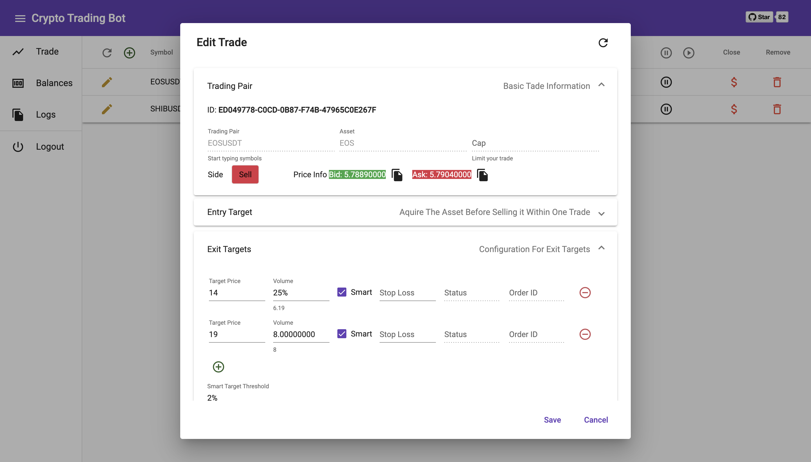

# Cryptobot
[](https://dev.azure.com/iluninigor/CryptoBot/_build/latest?definitionId=3&branchName=develop)

The main purpose of the bot is to keep track of your Binance trades while you're away. 
This bot is not supposed to earn money by itself, it requires targets and stop-loss inputs to follow your trades.

Binance REST API is based on [sammchardy/python-binance](https://github.com/sammchardy/python-binance) project

**Please read carefully all provided documentation before using the bot** 

## Disclaimer
- **Use it at your own risk.**
- It is not a commercial project, immediate response and or fixes are not guaranteed.
- This project was developed to improve my personal experience with Binance trading,
I am not taking any responsibility for the outcomes you get when using it.  
- Works on Mac and Amazon Linux. Other platforms were not verified.


## Features
- Simple Web User Interface 
- Manage an unlimited number of trading pairs
- Supports "smart" trade entry 
- Unlimited exit targets 
- Each exit target can be "smart" to gain max profits
- Flexible stop loss settings: Fixed/Trialing + Custom SL after each target reached
- One Cancels the Other functionality (OCO) 
- FREE :)

Edit View: 

## Limitations
- Can't have multiple trades for one trading pair
- If you place orders manually, there is a chance they will be canceled by bot

## Installation
[Setup Instructions](./Docs/SETUP.md)

## Flow
[Flow Description](./Docs/FLOW.md)

## Trade File
[Trade File Description](./Docs/TRADE_FILE.md)

[Trade File Examples](./Docs/TRADE_FILE_EXAMPLES.md)

## Management API (Coming soon)
[API](./Docs/API.md)

## Channels
[Telegram Discussion Channel](https://t.me/CryptoTradingBotDiscussion)

[Telegram Announcement Channel](https://t.me/OpenSourceCryptoTradingBot)

---
# Build angular
```
cd ./admin
RUN npm i --package-lock-only
RUN npm audit fix
ng
ng serve
ng build
...
```

# Build All project to docker
file: Dockerfile
## Choose build image for 'dockerfile'

## Build success -> check image id
```
docker images
```


---
# Build Docker


## Show images
docker images
```
REPOSITORY   TAG        IMAGE ID       CREATED         SIZE
<none>       <none>     cc823895eba8   4 minutes ago   1.04GB
```
## Add tag
docker image tag <IMAGE> <docker-username>/<application-name>:<tag-name>
```
Example:
sudo docker image tag cc823895eba8 tranhoangson/bot99:latest
```
## Push to server
docker image push <docker-username>/<application-name>:<tag-name>
```
Example:
sudo docker image push tranhoangson/bot99:latest
```

## Run docker daemon
sudo dockerd

## Pull from server to local
docker image pull <docker-username>/<application-name>:<tag-name>
```
Example:
sudo docker image pull tranhoangson/bot99:latest
```

## Run docker image
```
sudo docker run -d --rm -p 3000:3000 --name cryptobot \
        -e "TZ=Asia/Tokyo" \
        -e "KEY=1DJpurs9YxVASRJ1CF7OakaLVFy10WIql0VcxA09mOLMtBmabct7o2KaYoTwljs9" \
        -e "SECRET=DUebcF7s2jsyW7yi0IyAZE8e2Q0Y2J26FKPrImnJi35jiXtubwENDptf5SWArEh4" \
        -e "API_USER=ANY_USER_NAME" \
        -e "API_PASS=ANY_PASSWORD" \
        -v $(pwd)/Active:/usr/src/trades \
        -v $(pwd)/Completed:/usr/src/complete_trades \
        -v $(pwd)/Config:/usr/src/configs:ro \
        tranhoangson/bot99:latest
```
ssda